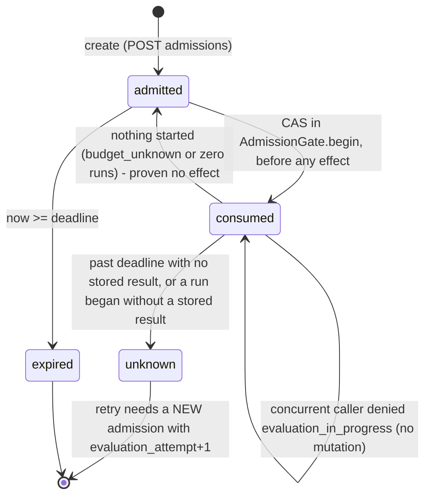

# Flow: evaluation admission, native evaluation and arms

Contract revision `pulso-two-teams-1`. Source: `src/pulso_core_runtime/evaluation/*`, `registry_service.py`,
`harness.py`. Plan reference: 17.3.5. Related ADRs: 0002 (digest, admission states, early close), 0007 (context ref).

## Admission (`POST /internal/v1/evaluation/admissions`)
Purpose `evaluation_admit`, tenant from the signed claim, `job_id` from the token. `_admit_sync`:
1. body validates (`AdmissionRequest`, `extra=forbid`, `evaluation_context_ref` format per ADR 0007);
2. broker check, scope `evaluation_admit`, digest of the body without `request_digest` (deny = `broker_denied` 403);
3. `deadline` in the future, `budget_ref` resolves for the tenant (`budget_unknown` 403);
4. fresh `get_proposal`: state `candidate` and `candidate_hash` equal (`candidate_changed` 409), suite content digest
   equal (`suite_mismatch` 409);
5. create the row (`201` created, `200` replay). A replay must be the same admission field by field, else
   `idempotency_conflict` (409).

Row states in `pulso_bridge.eval_admissions`: `admitted`, `consumed`, `expired`, `unknown`.

## Native evaluation on the Flow path
`FlowEvaluationGate.evaluate` (called by the protected writer for `registry/evaluate`) -> `EvaluationRuntime.evaluate`:
1. validate ref, load the admission (`admission_missing` 403), fresh `get_proposal` view, check whether the registry
   already holds a write for `pulso-eval:<ref>` (replay);
2. `AdmissionGate.begin` checks in order: binding confirmed, `evaluate_enabled`, ref valid, admission exists and matches
   tenant/job/binding (`admission_cross_tenant`), proposal (`admission_proposal_mismatch`), attempt; **replay returns the
   admission without CAS or run**; then state `unknown` -> `evaluation_unknown`; `consumed` before the deadline ->
   `evaluation_in_progress` without mutation, after it -> `unknown`; not `admitted` -> `admission_not_admitted`; deadline;
   candidate unchanged and suite equal (`candidate_changed`, `suite_mismatch`); broker `native_evaluate` with the one
   canonical digest (ADR 0002), fail closed; CAS `admitted -> consumed` (a lost CAS is `evaluation_in_progress`);
3. resolve the budget (clamped to the admission deadline) and build a per-admission `RegistryService` clone bound to a
   `BoundEvaluator`; call `evaluate` with key `pulso-eval:<ref>`;
4. persist the **full** report in `pulso_bridge.eval_reports` (stock Core keeps only the verdict; after `fail` the proposal
   returns to draft and `last_eval` is null), with `pulso_evidence{closed_early, closed_early_runs, runs}`;
5. a `gate_failed` 409 is re-raised unchanged (body untouched) with the stored report digest/run ref attached; the tool
   result carries `{verdict, eval_run_ref, report_digest}` (`error gate_failed` for a fail).

The shared process-wide `RegistryService` is `FailClosedRegistryService`: with no admission bound `evaluate` has no
effect (no write, no quota, no run) and returns `failed_infra: no_admission`, so it cannot burn a future key.

`PulsoEvalPort.run_admitted` runs a fresh `ScenarioEvaluator(PulsoScenarioHarness(mode="native"), LocalSandbox,
max_workers=1)` under the process-wide `EvaluationGate` (`Semaphore(permits` from `PULSO_EVAL_PERMITS`, default 1), bounded waiters 8,
wait 30 s; overflow = `HarnessUnavailable("evaluation_busy")` -> `failed_infra`). Every unexpected failure becomes a
`failed_infra` report, never a pass and never a 500.

## Harness (`PulsoScenarioHarness`)
One class, three modes: `native`, `task_builder`, `stateful_attention`. Differences from the pinned harness: run
`idempotency_key` unique per execution (`eval-<sha256(execution_id|scenario|arm|repetition|nonce)>`, so a persistent
eval DB never replays a stored run; first RED `tests/l5/test_collision.py`), sealed manifest inputs in the task modes,
budget meter in front of the gateway, refuses a registry that is not a `SnapshotRegistry`, per-evaluation context passed
explicitly (no ContextVar, the evaluator uses a thread pool). Budget (`EvalBudgetMeter`): sums cost/tokens, counts jobs,
enforces the deadline, and charges the atomic ledger `ReceiptStore.meter_spend` (refused spend -> `cost_usd_max`,
unreachable ledger -> `ledger_unavailable`); exhaustion is `failed_infra`.

Run count for one native evaluation follows the pinned harness semantics: `N(new)+N(old)`, `N(new)+2*N(old)` or `N(new)`
(six or nine unique run IDs for the 3-repetition single-scenario cases); the plan's older "seven" sentence is
inconsistent (BITACORA L5).

## Arms (`POST /internal/v1/evaluation/arms/run`, `GET .../arms/{id}`, `GET .../arms/by-key/{key}`)
Purposes `evaluation_arm_run` / `evaluation_arm_read`. `ArmRunner.run` (status `completed | candidate_failed |
failed_infra | unknown`):
1. validate `ArmRequest` (`extra=forbid`, so no gold/oracle field can ride along); `native` with any `seed_manifest_ref`
   is `mixed_world_rejected`; task modes require a sandbox and `seed_manifest_ref` (`sandbox_required`);
   `supersedes_execution_id` is only valid for a reconciled `unknown` arm;
2. single-flight by `(tenant, idempotency_key)`; `execution_id = arm-<sha256(tenant|key)[:32]>` allocated before any
   effect; same key and digest returns the stored report (or `unknown`, `interrupted`), a different digest is
   `idempotency_conflict`;
3. broker `evaluation_arm` check (denied closes the row as `failed_infra`, zero work);
4. load the target (`TargetLoader`, a snapshot registry; commitment mismatch or any problem is `failed_infra`
   `target_preparation_failed`); 5. fetch the sealed scenario manifest through the broker artifact port
   (`manifest_missing`, `manifest_empty` are `failed_infra`); 6. resolve the budget (`budget_unknown`);
   7. non-native modes use `BrokerSandboxClient` (`/sandbox/sessions|reset|actions|actions/{key}|close`); transport
   failure after an action may have reached the bank is `unknown`, failure before is `failed_infra`; schema violations
   are `candidate_failed`; an action without read-back is `unknown`; 8. run each scenario under the evaluation gate, build
   the report (`event_refs`, `effect_receipts`, `final_state_ref`, `initial_state_digest`, `usage`, `cost_known`,
   `closed_early`, `closed_early_runs`).
A `running` row that nobody in this process executes is settled as `unknown` (`interrupted`). Another tenant's row looks
like a missing one.

## HTTP-campaign wrapper
For the `registry_http_contract` path an `ApiExtension` shadows `POST /v1/registry/proposals/{pid}/evaluate`, reads
`X-Pulso-Evaluation-Context`, runs the same `AdmissionGate` through `EvaluationRuntime.evaluate`, and passes upstream
outcomes (409 `gate_failed`, 429, `candidate_changed`) through unchanged; `single_handler_cleanup` removes the shadowed
upstream route. The header cannot protect the in-process Flow path.

## Gaps
- The arm/campaign wire names (`ArmRequest`/`ArmReport`) follow plan 17.3.5 and annex D proposals; Codex confirmation
  (A05) is recorded as pending in the module docstring.
- Budget resolution is a static file (`PULSO_EVAL_BUDGETS`); the control-api budget contract is undefined and reported in
  `/version.doubles[]`. Without the file every `budget_ref` fails closed.
- The stateful bank is a loopback double in tests (`BankBackend`); the real lab-broker sandbox is Codex-owned.
- Persistent replay of evaluation across restarts was not asserted as verified in this documentation pass.
