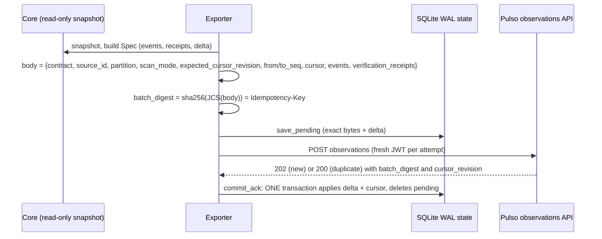

# Flow: exporter cursor and compare-and-set (CAS)

Contract revision `pulso-two-teams-1`, wire contract `pulso-observations-2`. Source:
`src/pulso_core_runtime/exporter/{service,state,reader,artifact,auth,config,runner,__main__}.py`. Plan reference: 17.3.6.

The exporter is a separate entrypoint (`python -m pulso_core_runtime.exporter`) that reads Core **read-only** and posts
batches to the Pulso control API. It never uses `AuditSink.read`, `PostgresOutbox.pending` or `mark_delivered`, never
touches `core_eval`, and its only DSN is the `exporter_ro` one (`CORE_EXPORT_DATABASE_URL`). A privilege guard
(`exporter_overprivileged`) and an eval-database guard (`eval_db_misconfigured`) stop it when misconfigured.

## Sources and partitions
Sources are `<instance>.audit`, `<instance>.registry`, `<instance>.outbox`. Reader tables are exactly `audit_events`,
`reg_events`, `outbox` (`runs`, `usage`, `reg_blobs`, `reg_proposals` are forbidden); column drift is `schema_drift`.
One connection per poll, `REPEATABLE READ READ ONLY`. Audit partitions are derived per run (`_part`), registry and outbox
use one partition each.

## Batch cycle (persist, POST, ACK, commit)

- The pending batch is stored **before** the POST and re-POSTed byte for byte after any crash or timeout; a new batch is
  never built while an un-ACKed one exists (`_blocked`). A 200 duplicate ACK is accepted and counted
  (`duplicate_acks`); an ACK whose `batch_digest` differs from the idempotency key stops the partition
  (`ack_digest_mismatch`).
- **First RED** (`tests/l6/test_first_red.py`): a crash after the ACK and before the local cursor commit must not double
  count; the re-POST of the persisted pending batch returns 200 duplicate.

## Cursor and CAS
- Cursor authority is Pulso's. The local `partition_cursor(partition, cursor, revision)` row only changes inside
  `commit_ack`, from the ACK's `current_cursor` and `cursor_revision`, and only for `scan_mode == fast_poll`.
  Rescan batches never advance a checkpoint.
- Each `fast_poll` body carries `expected_cursor_revision` (the local revision). Pulso answers
  `409 stale_cursor_revision` when another writer advanced it: the exporter drops the pending batch, refreshes the
  authoritative cursor (`GET /internal/v1/platform/exporters/<source>/partitions/<partition>/cursor`), sets the local
  cursor and rebuilds, retrying up to 3 times per drain.
- **Lost local state**: with no local cursor the exporter reads Pulso's cursor with `strict` semantics (a failed read
  defers; it never pretends "no checkpoint"). If the remote revision is > 0, Pulso's cursor wins and the
  `exporter_rebuild` marker is recorded and reported as a coverage reason.
- Cursor strings are deterministic: audit `a.<sha256(prev cursor | hashes)[:40]>` (fast poll) or `scan.<...>`; sparse
  `s.<seq>` and `late.<seq>`.

## Error handling in `_post`
| Response | Action |
|---|---|
| network error / timeout | backoff (exponential, cap 60 s, jitter), retry the stored bytes up to `max_retries` (5); then defer |
| 429, 503 | backoff honouring `Retry-After` |
| 409 `stale_cursor_revision` | refresh cursor, rebuild (above) |
| other 409 | stop partition `digest_conflict:<error>`; pending kept for diagnosis |
| 422 | quarantine the batch, stop partition `quarantined:<error>` |
| 401/403/413/other | stop partition `http_<code>` |

## Audit chain verification and artifacts
Audit observations carry `source_event=null`, the native hash as `source_event_digest`, and a reference to an exact-bytes
NDJSON chain artifact (stored `event_json` lines, LF terminated, no rewriting; digest is raw SHA-256; <= 1 MiB per
artifact, larger chains are complete-line chunks plus a manifest; <= 64 MiB total) uploaded through the broker artifact
route. Verification uses the pinned `check_chain` over the full authorised prefix from seq 0 and ships
`verification_receipts` (`verified_through_seq`, `chain_head_hash`, `check_result`, verifier sha and contract version).
Rows that fail verification are never exported; the run is flagged and excluded from completeness
(`run_chain_broken`). Registry and outbox rows are sent as the pinned public projections.

## Holes, late rows, rescan, sweep
- Sparse sources (`reg_events`, `outbox`) with a seq gap: the hole is noted as one inclusive range; the batch is held back
  for `gap_grace_seconds` (120 s) and then the range is skipped and reported (`registry_seq_gap_unverified`). Rows that
  appear later inside a skipped range are exported as `rescan`/`late` (`holes_cleared` splits the range).
- `rescan` (default every 900 s): compares exported `(run, seq)` hashes with Core (a changed hash is `source_conflict`
  and stops the audit partitions), re-exports verified rows missing from the local ledger as `late`, and re-exports the
  full prefix of every open run as `open_run`.
- `sweep` (default every 24 h): full pinned `check_chain` over every run plus the ledger comparison.
- `run_loop` schedule: poll every 5 s; errors are closed codes only.

## Observability, config, permissions
`PollReport`/`coverage()` report `partial|unknown` with closed `missing_reason` codes and never payloads. Config names:
`CORE_EXPORT_DATABASE_URL`, `PULSO_CONTROL_API_URL`, `PULSO_SERVICE_KEY_REF`, `PULSO_TENANT_ID`. Tokens: see ADR 0005.
Limits: batch <= 500 events and 512 KiB.

## Gaps
`cut_ref` is always null (no consistent cut is produced). Source schema artifacts are bootstrapped through the artifact
route unless refs are configured. Real control-api behaviour is not exercised (the ingest side is the double in
`platform-sim/ingest_fixture`). `docker-entrypoint.sh` lists `seed|bootstrap|sweep` modules that do not exist as
`pulso_core_runtime.<name>` in this tree (the exporter module exposes its own `__main__`); not verified how `sweep` is
meant to be started from the image.
