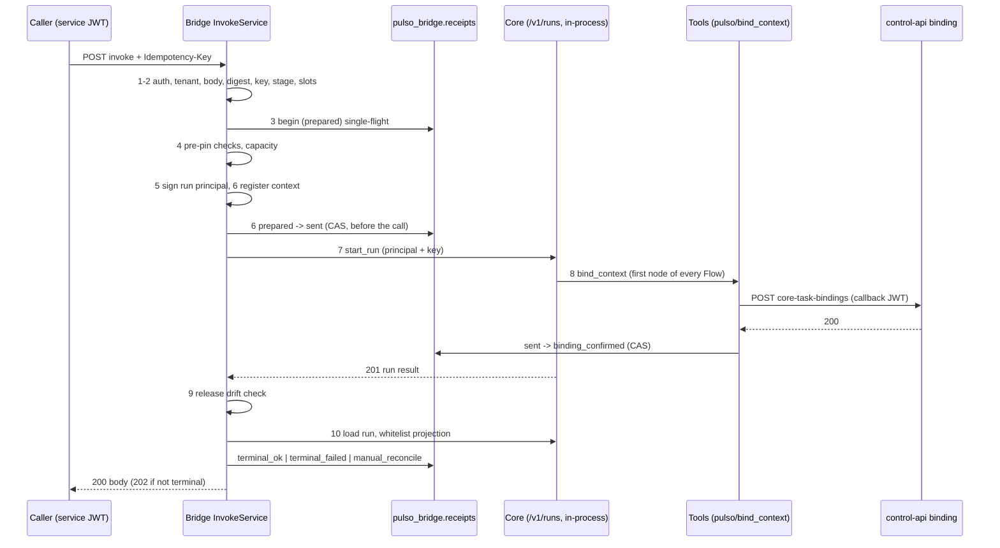

# Flow: `POST /internal/v1/core-tasks/invoke` (the eleven steps)

Contract revision `pulso-two-teams-1`. Source: `src/pulso_core_runtime/invoke/service.py::InvokeService`,
`invoke/routes.py`, `invoke/binding.py`, `store/receipts.py`. Plan reference: 17.3.3.

Actors: control-api/worker (caller), core-bridge (this package), in-process Core (reached only through
`CoreRuns`/ASGI `AsgiCoreClient`, never a direct `TurnEngine` call), control-api binding endpoint, lab-broker.

## Steps (as implemented)

| # | Step | Code path | Outcome on failure |
|---|---|---|---|
| 1 | Authenticate (route) and parse `CoreTaskInvocation` (`extra=forbid`) | `internal/app.py`, `invoke/models.py` | 401/403 envelope; 422 `pulso:invalid_request` with `details.fields` |
| 2 | Tenant claim equals body `tenant_id`; `request_digest` (if sent) equals `sha256(JCS(body minus request_digest, credentials, trace))`; `Idempotency-Key` equals `sha256(tenant|job|stage|attempt|logical_key)`; stage in `scout, verifier, builder_design, writer`; input + refs <= 256 KiB; every input slot declared by the stage catalogue | `_invoke` | 403 `tenant_mismatch`; 422 `invalid_request`; `stage_unknown`; `input_too_large`; `unknown_input_slot` |
| 3 | Single-flight on `(tenant, key)`: insert `prepared` under a per-key advisory lock | `ReceiptStore.begin` | Existing row: other digest is `digest_conflict` (409) with no second start; same digest re-enters (see below) |
| 4 | Pre-pin: release exists, is `active`, agent+version in the release, `closure_digest` equals `sha256(JCS(release.entities))` | `RegistryReleaseChecker.check` | receipt `terminal_failed` with `release_pin_unavailable` or `release_revoked`; then in-flight capacity (`PULSO_BRIDGE_MAX_INFLIGHT`, default 8): `bridge_busy` (429, retryable), the `prepared` row is discarded so a retry is clean |
| 5 | Sign the run principal (`pulso-bot:<tenant>:<task|writer>:<stage>`, role `constructor` for the writer else `stage_task`, TTL 15 min) with the bridge identity key; attrs `tenant, job, stage, attempt, grant_ref, task_binding_ref, pin_release_id` | `PrincipalSigner.sign` | n/a |
| 6 | Build the frozen `InvocationContext`, register it under `task_binding_ref = sha256(tenant|key)`, persist it (`invocation_contexts`, including the sealed commitment), then CAS `prepared -> sent` **before** the call | `_execute` | Lost CAS: context removed, row re-entered (another instance owns the key) |
| 7 | Call Core through the full M9 route (`start_run(bearer, key, {agent, subject:null, input, lang})`) inside `use_binding(ref)` | `AsgiCoreClient` | Any exception or HTTP >= 500: `unknown` (never `failed`); 409: `manual_reconcile` `core_idempotency_conflict`; 429 -> 503, 401/403 -> 403, 404 -> 409, other -> 422 with `terminal_failed` (writer: `manual_reconcile`) |
| 8 | Inside the run, the Flow's first node `pulso/bind_context` posts the binding callback to control-api; on 200 the receipt moves `sent -> binding_confirmed` and the context becomes `confirmed`. (The code does not number this step; it is the in-run counterpart documented in `docs/flows/core-binding-context-channel.md`.) | `tools/bind.py`, `ConfirmingRegistry.confirm` | 404/409: binding denied (context `denied`); timeout/5xx: effect unproven -> `manual_reconcile` `binding_unproven`; every other tool and every model call is refused until confirmed |
| 9 | Release drift: Core's `release` must equal `inv.release_id`; otherwise the result is discarded | `_after_response` | `terminal_failed` (writer: `manual_reconcile`) `release_drift`, HTTP 409 |
| 10 | Outcome must be `completed` or `failed`; project the run through the stage whitelist (`CatalogProjector`), build the receipt (input commitment, output digest, budget `known` from the meter), persist, remove and soft-delete the context | `_after_response`, `_terminal` | other outcomes (for example escalated): `unexpected_outcome`, no facts promoted; `completed` without a confirmed binding: `manual_reconcile` `binding_unconfirmed` (HTTP 202); projection `BridgeError` (`output_missing`, `fact_schema_violation`, `output_too_large`): `terminal_failed`; unreadable run: `unknown` `projection_failed` |
| 11 | Any failure after `sent` that is not a proven outcome is `unknown`, and a later request with the same key re-reads Core and the registry instead of re-executing | `_mark_unknown`, `_reenter`, `Reconciler` | see `core-reconcile-matrix.md` |

## Re-entry with the same key and digest (`_reenter`)
- terminal: stored body, HTTP 200.
- `prepared`: if the row is younger than `prepared_stale` (30 s) a live invocation owns it -> 202 `task_in_progress`;
  otherwise it crashed before `sent`: the reconciler marks it `terminal_failed` `never_sent` with `proven_no_effect`.
- the key is in this process's live set: 202, never demoted.
- `sent`, `binding_confirmed`, `unknown`, `manual_reconcile`: reconcile (read-only) and return the stored or adopted
  result; never a second `start_run`.

## `GET /internal/v1/core-tasks/{task_id}`
Read-only. `task_id` is the idempotency key or the Core run id; a foreign tenant's id is 404. Non-terminal states carry
`code=pulso:task_unknown` (state `unknown`) or `pulso:task_in_progress`.

## Input and output
Input: `CoreTaskInvocation` (annex D.2) including the optional writer `registry_mutation_commitment`. Output body:
`{schema_version, state, core_run_id, reason, outcome, task_binding_ref}` plus `receipt`, `result` (whitelisted facts,
`output_digest`), `proven_no_effect`, `adopted_writes` when present. Errors use the D.1 envelope
`{schema_version, code, retryable, trace_id, details}`.

## Gaps
- Per-instance in-memory `_live` set: a second bridge instance with the same key relies on `prepared_stale` and the
  receipt CAS, not on shared liveness.
- No automatic scheduler re-drives `unknown` rows; reconciliation happens on the next request or on a manual call.
