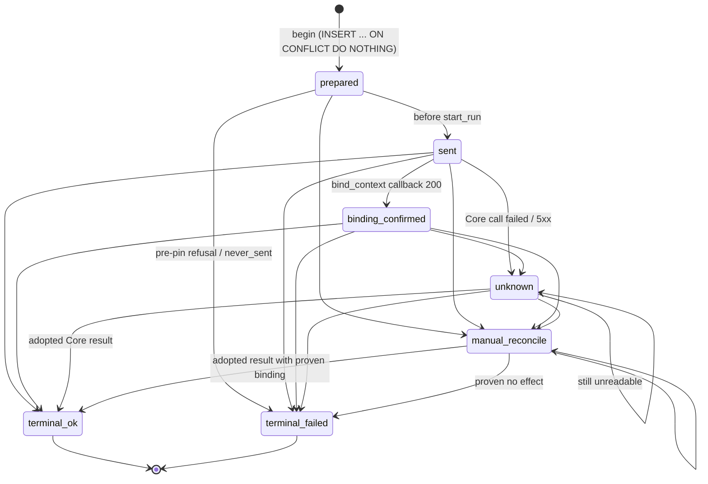

# Flow: receipts state machine

Contract revision `pulso-two-teams-1`. Source: `src/pulso_core_runtime/store/receipts.py`,
`store/migrations.py` (`l3_001_receipts_contexts_budget`), `invoke/service.py`.

Table `pulso_bridge.receipts`, primary key `(tenant_id, idempotency_key)`; columns include `request_digest`, `stage`,
`job_id`, `attempt`, `release_id`, `task_binding_ref`, `principal_id`, `core_run_id`, `state` (CHECK constraint),
`outcome`, `reason`, `receipt` (jsonb), `version`, timestamps. Companion tables: `invocation_contexts`
(frozen context, `deleted_at` soft delete) and `budget_meter` (calls, tokens, `cost_usd`, `usage_known`, `reconciled`).

## Transition rules (`ALLOWED_FROM`)
| Target | Allowed sources |
|---|---|
| `sent` | `prepared` |
| `binding_confirmed` | `sent` |
| `terminal_ok` | `sent`, `binding_confirmed`, `unknown`, `manual_reconcile` |
| `terminal_failed` | `prepared`, `sent`, `binding_confirmed`, `unknown`, `manual_reconcile` |
| `unknown` | `sent`, `binding_confirmed`, `unknown` |
| `manual_reconcile` | `prepared`, `sent`, `binding_confirmed`, `unknown`, `manual_reconcile` |

Terminal states (`terminal_ok`, `terminal_failed`) have no outgoing edge.

## Invariants
- **Single-statement CAS**: `UPDATE ... WHERE state = ANY(allowed sources) RETURNING *`; `None` means a lost race or a
  terminal row. `COALESCE` keeps previously stored `core_run_id`, `outcome`, `reason`, `receipt` when a transition does
  not supply them.
- **`sent` is committed before Core is called.** After that point nothing is ever reported as `failed` unless Core's
  result proves it. A failed writer maps to `manual_reconcile`, never `terminal_failed`, because the registry may have
  changed (`_failed_state`).
- **Single-flight**: `begin` takes `pg_advisory_xact_lock(hashtextextended(tenant|key))` only to serialise insert plus
  read; the row itself arbitrates. A different `request_digest` for an existing key is `digest_conflict` (409), with no
  second `start_run`.
- **Pre-send capacity refusal** deletes the `prepared` row (`discard_prepared`) so a retry with the same key starts
  clean; no other state is ever deleted.
- **Budget meter** (`meter_spend`) is one atomic capped statement: applied only while the new total stays <= the cap;
  negative, non-finite or unparsable amounts are refused. `meter_reconcile` flags a run's meter as reconciled, which the
  reconciler needs to prove "no Core commit and no effect".
- **Idempotency**: key `sha256(tenant|job|stage|attempt|logical_key)`; same key and digest never executes twice.

## Errors, permissions, observability
Error codes are `pulso:*` strings in the D.1 envelope. Writers of this table: the invoke service, the binding
confirmation (`ConfirmingRegistry.confirm`), and the reconciler; all through `ReceiptStore.transition`. The exporter and
Pulso services have no access to this table. Readable evidence: `GET core-tasks/{id}` and the `reason` column (closed
codes only, never payloads).

## Gaps
Contexts rows are soft-deleted on terminal state; an expired-context sweep exists (BITACORA, final review) but its
schedule is not documented here. No automatic re-drive of `unknown`/`manual_reconcile` rows.
